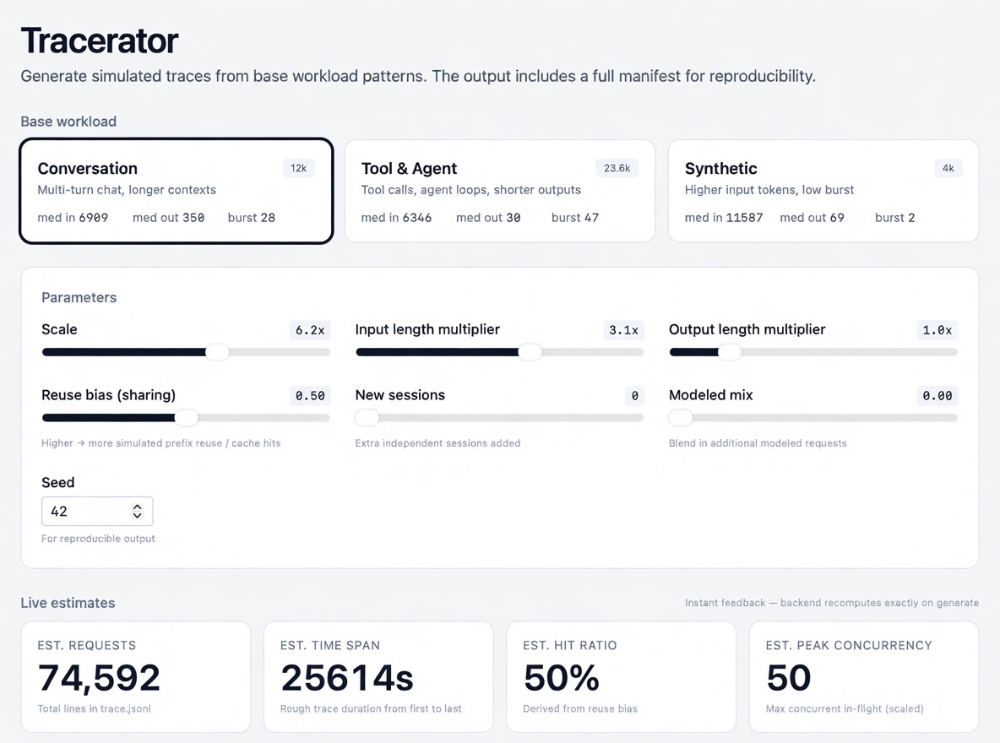
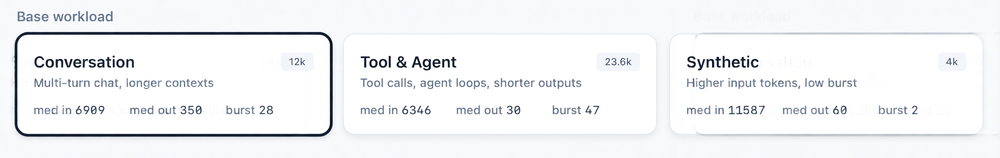
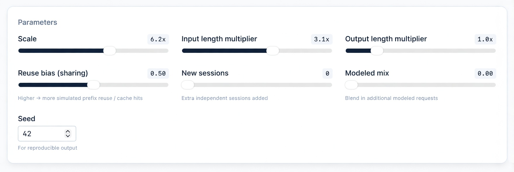
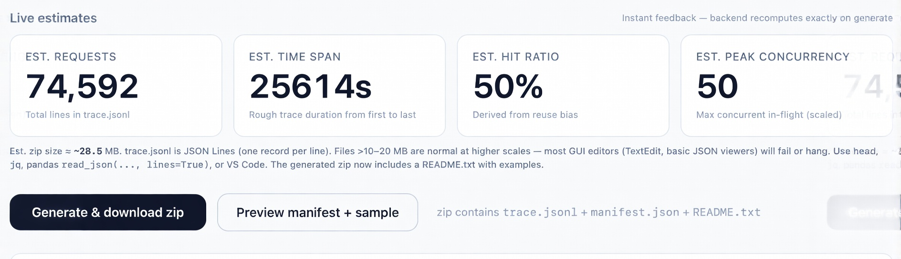
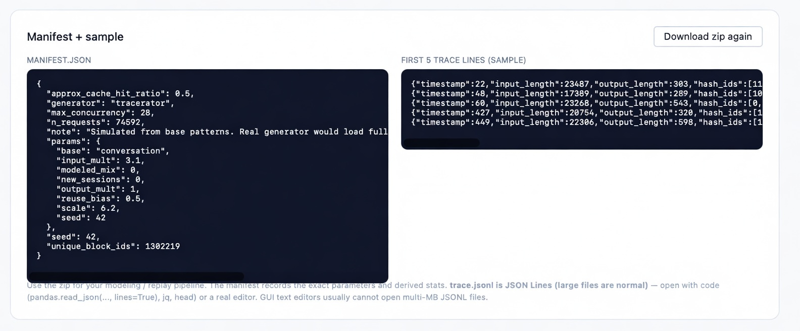

# Traces from Mooncake (FAST'25)

This directory contains the open-sourced production-derived request traces used in the Mooncake paper, plus tooling to understand them and generate scaled, parameter-controlled extensions that faithfully reproduce real enterprise LLM workload patterns.

## The Problem This Solves

You need more trace volume or "what-if" variants (longer contexts, higher cache intensity, different mixes, longer duration) for the perf modeling tool, but the traces must behave like real Kimi production traffic:

- Highly bursty arrivals (dozens of requests at the exact same millisecond)
- Heavy-tailed prompt & generation lengths
- Authentic KVCache reuse patterns: small number of extremely hot block prefixes (shared system prompts, agent scaffolds, popular RAG contexts) reused across thousands of requests; variable hit depths; session-like extensions that share long prefixes then branch on new user input.

Generic generators (independent requests, uniform or simple normal lengths, Poisson arrivals, random or independent hash_ids) will produce completely wrong prefill/decode costs, cache hit ratios, queuing, and transfer behavior. Mooncake's published gains (up to 5× effective capacity) come from exploiting exactly these real patterns.

## The Tool

The tool is called Tracerator. The graphical UI is the self-contained fancy page at `site/index.html` (with live estimates that update dynamically as you adjust the sliders).

To run (recommended):

```bash
./run_trace_ui.sh
```

(or manually `docker compose up -d`)

The launcher includes a pre-flight that checks for Docker and installs `jq` (highly recommended for inspecting the generated `trace.jsonl` files — every zip now contains a `README.txt` with usage examples).

Open http://localhost:8000 in your browser.

## UI (visual walkthrough)



### Base workload cards
Pick the starting pattern. The active card is ring-highlighted and shows the base characteristics.



### Parameters
Sliders for scale, length multipliers, reuse bias (cache hit intensity), new sessions, modeled mix, and a reproducibility seed.



### Live estimates
Four large cards give instant client-side approximations that mirror the backend formulas.



### Generate & preview
Download the full zip (trace + manifest + README) or preview the manifest + first sample lines directly in the browser.



The docker-compose uses a bind mount so the containerized app always serves the live `site/index.html` as its UI (refresh browser after edits; restart container for .py changes).

You can also run locally for development:

```bash
python3 -m venv .venv
source .venv/bin/activate
pip install -r requirements.txt
python app.py
```

Open http://localhost:8000.

## Current bases (first collection)

Three one-hour traces from real Kimi production traffic.

| Workload       | Requests | Max Burst | Median Input / Output | Cache Personality                  |
|----------------|----------|-----------|-----------------------|------------------------------------|
| Conversation   | 12,031   | 28        | 6.9k / 350            | Real multi-turn sessions, ~40% sharing |
| Tool & Agent   | 23,608   | 47        | 6.3k / 30             | Extremely high cache reuse, very bursty |
| Synthetic      | 3,993    | 2         | 11.6k / 69            | Public long-context data + Poisson arrivals (lower sharing) |

See the detailed [workload narrative and analysis](Mooncake/WORKLOAD_NARRATIVE.md) for deep statistics on burstiness, prefix cache behavior, length distributions, and why these patterns matter.

The original paper, traces, and system are available at the [Mooncake GitHub repo](https://github.com/kvcache-ai/Mooncake).

## Schema Reminder

Each line in a trace:

```json
{"timestamp": <ms>, "input_length": <prompt tokens>, "output_length": <gen tokens>, "hash_ids": [<block hash ids for KVCache paged prefix> ... ]}
```

The hash_ids are remapped block hashes. Matching prefixes across requests = KVCache hits (critical for the Mooncake disaggregated KVCache pool and scheduling efficacy).

## Next Steps / Handoff to Perf

1. Use the UI to produce the desired variant(s) + manifest(s).
2. The zip contains the trace.jsonl and manifest.json. The manifest records the exact base, all parameters, and output aggregate stats so the modeling run is fully traceable and reproducible.
3. **Validate the trace with AIPerf** (strongly recommended before or as part of perf modeling):
   - Static: `aiperf analyze-trace trace.jsonl --output-file analysis.json`
   - Full replay (exact timing + realistic KV prefix behavior via hash_ids):
     ```bash
     aiperf profile --model <model> --endpoint-type chat --streaming \
       --url http://... --input-file trace.jsonl \
       --custom-dataset-type mooncake_trace --fixed-schedule --tokenizer <hf-id>
     ```
   - Or use the convenience script in this repo:
     ```bash
     ./scripts/validate-with-aiperf.sh --with-replay --subset 50
     TRACE_FILE=your/trace.jsonl ./scripts/validate-with-aiperf.sh --with-replay
     ```
   See the full **instruction set**: [docs/VALIDATING_WITH_AIPERF.md](docs/VALIDATING_WITH_AIPERF.md), plus [Mooncake/trace_gen/README.md](Mooncake/trace_gen/README.md) and the companion [aiperf-toolkit](https://github.com/discoposse/aiperf-toolkit).
4. The receiving team can replay with the original Mooncake simulator, AIPerf (trace replay mode), or their modeling tool, knowing the workload characteristics and how they were derived from real traffic.

## References

- Paper + original traces: https://github.com/kvcache-ai/Mooncake
- The three traces correspond to the "Conversation", "Tool&Agent", and "Synthetic" workloads in §5.2.1 and Appendix A of the paper.

Questions on the semantics of the traces or how to interpret reuse should start from the narrative and the paper (especially the scheduling algorithm and the definition of effective request capacity under TTFT/TBT SLOs).

## License

This repository is licensed under the Apache License 2.0.

The trace data is derived from the open-sourced dataset in the Mooncake project, which is also licensed under Apache-2.0. The generator code, UI, and supporting files are additional work released under the same license.

See the LICENSE file for full details.

## Contributing

Contributions are welcome. See CONTRIBUTING.md for guidelines.

## Citation

If you use these traces or the generator in academic work, please cite the original paper:

```bibtex
@article{qin2024mooncake,
  title={Mooncake: Trading More Storage for Less Computation -- A KVCache-centric Architecture for Serving LLM Chatbot},
  author={Qin, Ruoyu and Li, Zheming and He, Weiran and Cui, Jialei and Ren, Feng and Zhang, Mingxing and Wu, Yongwei and Zheng, Weimin and Xu, Xinran},
  journal={arXiv preprint arXiv:2407.00079},
  year={2024}
}
```

## Acknowledgments

- The Mooncake team at Moonshot AI and Tsinghua University for open-sourcing the traces and the system.
- The original traces and paper are available at https://github.com/kvcache-ai/Mooncake.
