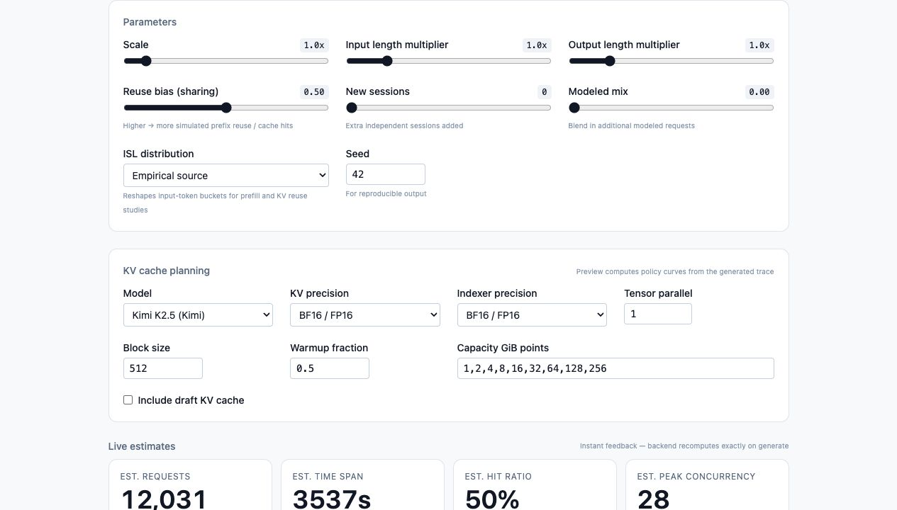
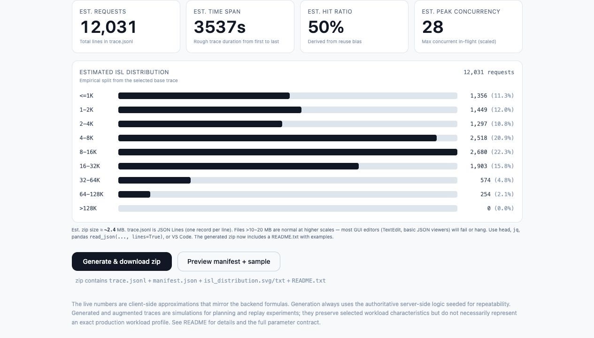
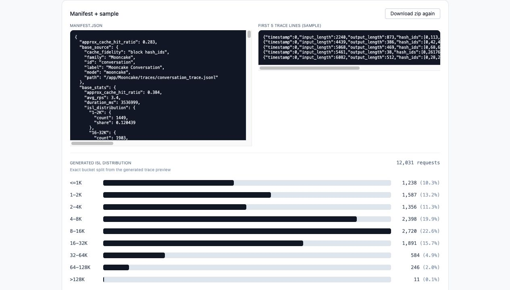
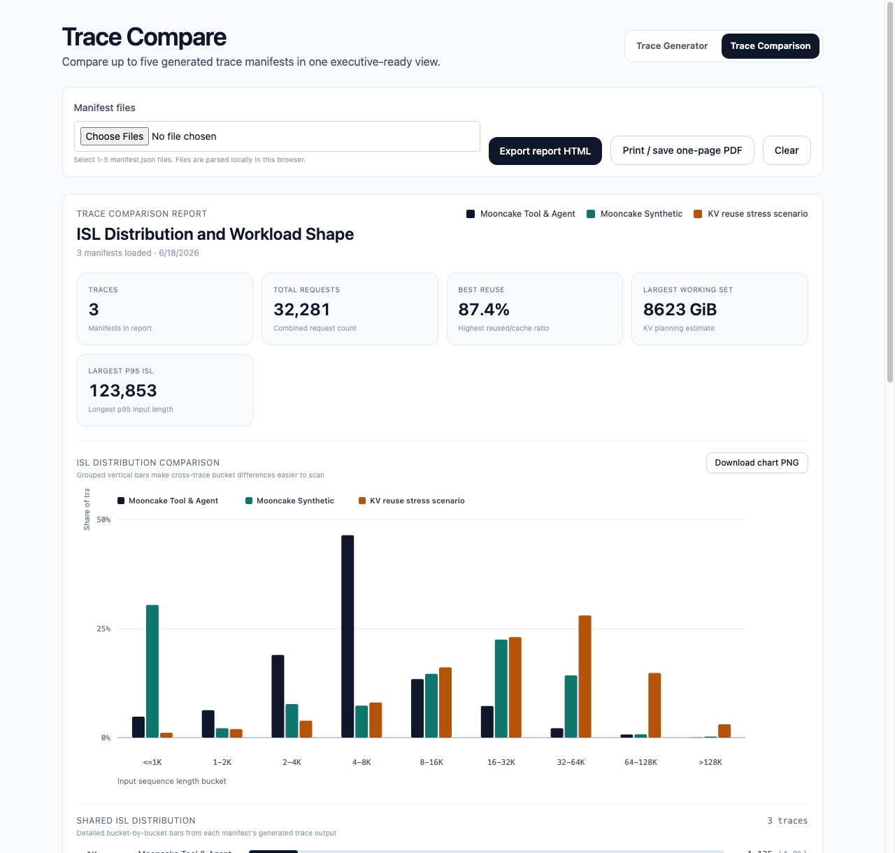

# Tracerator

Tracerator is a trace generation and comparison tool for LLM serving experiments. It turns baseline workload traces into reproducible, parameter-controlled variants, packages them for replay/modeling pipelines, and provides a browser UI for comparing generated manifests.

The repository includes production-derived Mooncake FAST'25 traces as bundled baseline sources, but the project is Tracerator: the generator, UI, manifest/report tooling, source import path, and validation workflow around those traces.

## What Tracerator Does

Tracerator helps create more trace volume and "what-if" variants for performance modeling:

- Longer or shorter contexts
- Higher or lower prefix reuse/cache intensity
- Different ISL distributions and workload mixes
- Additional sessions and scaled request counts
- Reproducible manifests for handoff and comparison

The goal is to preserve workload properties that matter for LLM serving experiments:

- Highly bursty arrivals (dozens of requests at the exact same millisecond)
- Heavy-tailed prompt & generation lengths
- Authentic KVCache reuse patterns: small number of extremely hot block prefixes (shared system prompts, agent scaffolds, popular RAG contexts) reused across thousands of requests; variable hit depths; session-like extensions that share long prefixes then branch on new user input.

Generic generators (independent requests, uniform/simple-normal lengths, Poisson arrivals, random or independent `hash_ids`) can produce misleading prefill/decode costs, cache hit ratios, queuing, and transfer behavior. Tracerator keeps source provenance and cache-prefix structure explicit so generated traces remain useful for replay and planning.

Generated and augmented traces are simulations for planning and replay experiments. They preserve selected workload characteristics from the source traces, but they should not be treated as exact production workload profiles.

## Run Tracerator

The graphical UI is the self-contained page at `site/index.html`, served by the Flask backend with live estimates that update as you adjust the controls.
It has two browser pages: **Trace Generator** at `/` for creating trace outputs, and **Trace Comparison** at `/compare` for reviewing up to five manifest files in one report.

To run (recommended):

```bash
./run_trace_ui.sh
```

(or manually `docker compose up -d`)

The launcher includes a pre-flight that checks for Docker and installs `jq` (highly recommended for inspecting the generated `trace.jsonl` files — every zip now contains a `README.txt` with usage examples).

Open http://localhost:8000 in your browser.

## UI (visual walkthrough)


### Baseline trace source
Pick the starting pattern from the Baseline trace source dropdown.

### Parameters
Sliders for scale, length multipliers, reuse bias (cache hit intensity), new sessions, modeled mix, and a reproducibility seed.



Tracerator also supports explicit **ISL distribution shaping** for prefill/KV-cache studies. You can keep the empirical source trace or target named profiles such as `rag`, `balanced`, `long_context`, and `short_chat`. The production Streamlit UI also supports custom bucket weights over:

`<=1K`, `1-2K`, `2-4K`, `4-8K`, `8-16K`, `16-32K`, `32-64K`, `64-128K`, `>128K`.

The generator samples real observed lengths inside the selected bucket when possible, adjusts only bounded tails when needed, and then regenerates or trims `hash_ids` so every output record remains AIPerf-ready.

### Live estimates
Four large cards give instant client-side approximations that mirror the backend formulas.



### Generate & preview
Download the full zip (trace + manifest + README) or preview the manifest + first sample lines directly in the browser.



### Trace Compare
Use the **Trace Comparison** nav link, or open `/compare`, to load up to five generated `manifest.json` files into a shared ISL distribution graph, colored legend, KPI summary, and executive comparison table. The comparison page can export a standalone HTML report, download the vertical comparison chart as a PNG, or use browser print/save-as-PDF for a formatted single-page report.



See [docs/TRACE_UI.md](docs/TRACE_UI.md) for a compact guide to the two-page UI and report export flow.

The docker-compose uses a bind mount so the containerized app always serves the live `site/index.html` as its UI (refresh browser after edits; restart container for .py changes).

You can also run locally for development:

```bash
python3 -m venv .venv
source .venv/bin/activate
pip install -r requirements.txt
python app.py
```

Open http://localhost:8000.

## Bundled Baseline Sources

Tracerator ships with three Mooncake-derived one-hour baseline traces from real Kimi production traffic. These are baseline sources for generation, not the whole project.

| Workload       | Requests | Max Burst | Median Input / Output | Cache Personality                  |
|----------------|----------|-----------|-----------------------|------------------------------------|
| Conversation   | 12,031   | 28        | 6.9k / 350            | Real multi-turn sessions, ~40% sharing |
| Tool & Agent   | 23,608   | 47        | 6.3k / 30             | Extremely high cache reuse, very bursty |
| Synthetic      | 3,993    | 2         | 11.6k / 69            | Public long-context data + Poisson arrivals (lower sharing) |

See the detailed [workload narrative and analysis](Mooncake/WORKLOAD_NARRATIVE.md) for deep statistics on the bundled source traces: burstiness, prefix cache behavior, length distributions, and why these patterns matter.

The original Mooncake paper, traces, and system are available at the [Mooncake GitHub repo](https://github.com/kvcache-ai/Mooncake).

The launcher also discovers optional local baseline collections when mounted:

- `TRACERATOR_RAGPULSE_DIR` (default `/Users/ewright/Documents/RAGPulse`)
- `TRACERATOR_CC_WEKA_DIR` (default `/Users/ewright/Documents/cc-traces-weka-with-subagents-051826`)
- `TRACERATOR_CODEX_SWEBENCHPRO_DIR` (default `/Users/ewright/Documents/codex_swebenchpro_traces`)
- `TRACERATOR_AIPERF_TOOLKIT_DIR` (default `/Users/ewright/Documents/aiperf-toolkit`)

`./run_trace_ui.sh` mounts these read-only into the container through `docker-compose.yml`. Sources with complete KV/prefix information are selectable for generation. Sources missing `hash_ids`, or local Git LFS payloads, are shown as unavailable with a status reason instead of being silently ignored.

To download the CC Weka with subagents Git LFS payload into the local checkout:

```bash
scripts/fetch-baseline-traces.sh cc-weka-subagents
./run_trace_ui.sh
```

## Importing More Real-World Sources

Tracerator is source-agnostic as long as the source can be mapped to the replay schema used here: timestamped requests with input/output lengths and ordered prefix `hash_ids`. Current useful sources:

- **Mooncake**: production-derived Kimi traces already included in this repo.
- **RAGPulse**: public RAG workload trace from a university Q&A deployment ([paper](https://arxiv.org/html/2511.12979v1), [dataset](https://huggingface.co/datasets/flashserve/RAGPulse), [repo](https://github.com/flashserve/RAGPulse)). Its records include `timestamp`, `input_length`, `output_length`, `hash_ids`, and `session_id`; use component import mode because its hashes identify prompt components/documents rather than 512-token KV blocks.
- **LMCache agentic traces**: public multi-turn agentic sessions useful for stateful prefix-growth workloads ([dataset](https://huggingface.co/datasets/sammshen/lmcache-agentic-traces)), if converted into the same schema.

Importer examples:

```bash
# Existing block-hash trace
python scripts/import_trace_source.py source.jsonl \
  --mode mooncake \
  --timestamp-unit milliseconds \
  --source-name my-source \
  -o imported_trace.jsonl

# RAGPulse-style component hashes; timestamps are documented in seconds
python scripts/import_trace_source.py ragpulse.jsonl \
  --mode component \
  --timestamp-unit seconds \
  --source-name ragpulse \
  -o ragpulse.mooncake.jsonl
```

The importer writes a companion manifest and refuses to finish unless every record satisfies `len(hash_ids) == ceil(input_length / 512)`.

## Schema Reminder

Each line in a trace:

```json
{"timestamp": <ms>, "input_length": <prompt tokens>, "output_length": <gen tokens>, "hash_ids": [<block hash ids for KVCache paged prefix> ... ]}
```

The `hash_ids` are remapped block hashes. Matching prefixes across requests represent KVCache hits, which are critical for cache-aware serving experiments.

Integrity guarantees for generated/imported traces:

- `timestamp` is in milliseconds for AIPerf fixed-schedule replay.
- `input_length` and `output_length` are positive integers.
- `hash_ids` are ordered prefix block identifiers.
- `len(hash_ids) == ceil(input_length / 512)` for every record.
- Manifests include source provenance, parameters, ISL bucket distribution, cache-hit estimate, and AIPerf readiness metadata.

## Next Steps / Handoff to Perf

1. Use the UI to produce the desired variant(s) + manifest(s).
2. The zip contains the trace.jsonl and manifest.json. The manifest records the exact base, all parameters, and output aggregate stats so the modeling run is fully traceable and reproducible.
3. **Validate the trace with AIPerf** (strongly recommended before or as part of perf modeling):
   - Static: `aiperf analyze-trace trace.jsonl --output-file analysis.json`
   - Full replay (exact timing + realistic KV prefix behavior via hash_ids):
     ```bash
     aiperf profile --model <model> --endpoint-type chat --streaming \
       --url http://... --input-file trace.jsonl \
       --custom-dataset-type mooncake_trace --fixed-schedule --tokenizer <hf-id>
     ```
   - Or use the convenience script in this repo:
     ```bash
     ./scripts/validate-with-aiperf.sh --with-replay --subset 50
     TRACE_FILE=your/trace.jsonl ./scripts/validate-with-aiperf.sh --with-replay
     ```
   See the full **instruction set** (canonical guide):
   [docs/VALIDATING_WITH_AIPERF.md](docs/VALIDATING_WITH_AIPERF.md)

   For a complete local stack (AIPerf + vLLM/Ollama setup scripts, validation helpers, LMCache support on macOS/Linux):
   https://github.com/discoposse/aiperf-toolkit

   Also see [Mooncake/trace_gen/README.md](Mooncake/trace_gen/README.md) (especially the section on the improved `reuse_bias` + `reuse_temperature` controls for predictable cache hit ratios).
4. The receiving team can replay with AIPerf, the original Mooncake simulator, or their modeling tool, knowing the workload characteristics and how they were derived from the selected source trace.

## References

- Tracerator includes baseline traces derived from Mooncake: https://github.com/kvcache-ai/Mooncake
- The bundled Mooncake-derived traces correspond to the "Conversation", "Tool&Agent", and "Synthetic" workloads in §5.2.1 and Appendix A of the paper.

Questions on the semantics of the traces or how to interpret reuse should start from the narrative and the paper (especially the scheduling algorithm and the definition of effective request capacity under TTFT/TBT SLOs).

## License

This repository is licensed under the Apache License 2.0.

The bundled trace data is derived from the open-sourced dataset in the Mooncake project, which is also licensed under Apache-2.0. The Tracerator generator code, UI, comparison report tooling, docs, and supporting files are additional work released under the same license.

See the LICENSE file for full details.

## Contributing

Contributions are welcome. See CONTRIBUTING.md for guidelines.

## Citation

If you use the bundled Mooncake-derived traces in academic work, please cite the original paper:

```bibtex
@article{qin2024mooncake,
  title={Mooncake: Trading More Storage for Less Computation -- A KVCache-centric Architecture for Serving LLM Chatbot},
  author={Qin, Ruoyu and Li, Zheming and He, Weiran and Cui, Jialei and Ren, Feng and Zhang, Mingxing and Wu, Yongwei and Zheng, Weimin and Xu, Xinran},
  journal={arXiv preprint arXiv:2407.00079},
  year={2024}
}
```

## Acknowledgments

- The Mooncake team at Moonshot AI and Tsinghua University for open-sourcing the traces and the system.
- The original traces and paper are available at https://github.com/kvcache-ai/Mooncake.
