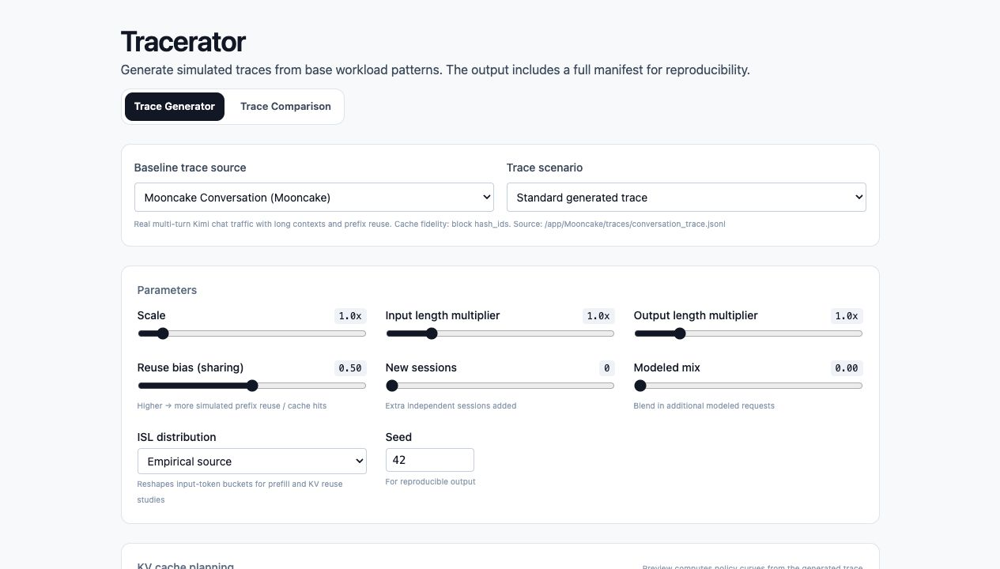

# Tracerator UI

Static UI served by the backend.



The app has two linked pages:

- **Trace Generator** at `/` for producing trace bundles and manifest previews.
- **Trace Comparison** at `/compare` for comparing up to five `manifest.json` files in a shared report.

Run with Docker Compose from the project root for the full experience:

```bash
docker compose up
```

Then browse to http://localhost:8000.

Generated and augmented traces are simulations for planning and replay experiments; they do not necessarily represent exact production workload profiles.

See the main [README.md](../README.md) and [TRACE_UI.md](../docs/TRACE_UI.md) for full instructions, pre-flight launcher, and details.
